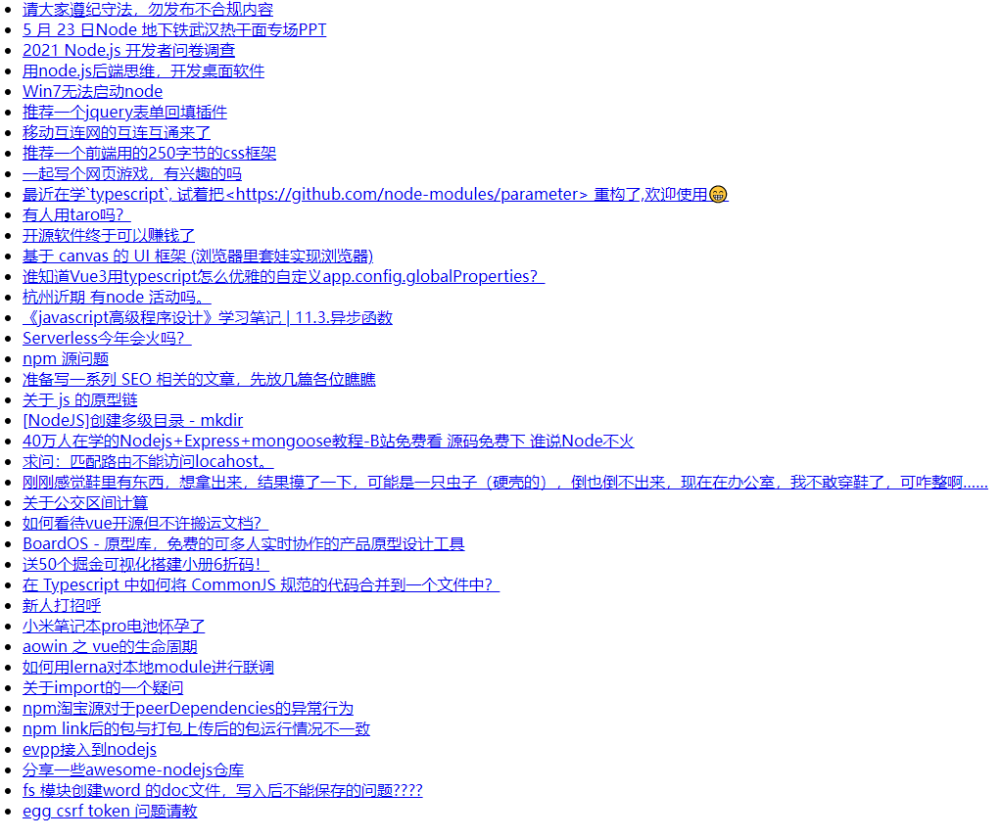

# Vuex

实际开发时，最好的做法时把网页拆分成一个个的组件，为了更好的进行组件之间的数据通信，我们应该把所有的数据都放到Vuex中，这样所有的组件都可以直接vuex来共享数据。

## 1.基本用法

### 1.用途：

- 保存数据的
- 所有的组件都可以直接使用

### 2.Vuex组成

- state： 数据
- mutations: 函数， 用来修改数据的函数（写同步代码）
- getters: 访问器， 函数
- actions: 函数，当需要调用接口(异步)来修改数据时，否则写到mutations

### 3.案例演示

   .


实现思路：

1. 在store目录下创建index.js
2. 定义state， mutations, actions
3. 在页面组件中使用store上的数据
4. 在页面组件绑定两个点击方法，实现同步加，异步加


1. 在store目录下创建index.js,   定义state时，注意写成函数返回对象，避免多个实例共享一个对象地址

   ```javascript
   export const state = ()=>({
       count:0
   })
   ```

3. 定义mutations 完成同步数据的修改

   ```javascript
   export const mutations = {
        increment (state, payload) {
           state.count+=payload;
        }
   }
   ```

4. 定义actions完成异步数据修改

   ```javascript
   export const actions = {
        asyncIncrement ({commit},payload) {
           setTimeout (()=> commit('increment',payload), 1000);
        }
   }
   ```

4. 页面使用

   ```javascript
   <template>
     <div>
          <h2>{{ $store.state.count }}</h2>
          <button @click="increment(10)">同步加</button>
          <button @click="asyncIncrement(20)">异步加</button>
     </div>
   </template>
   
   <script>
   export default {
       methods:{
          increment(step) {
             this.$store.commit('increment', step);
          },
          
          asyncIncrement (step) {
             this.$store.dispatch('asyncIncrement', step);
          }
       }
     
   };
   </script>
   ```

   

   

   总结： nuxt.js 已内置```vuex```模块，只需要在store目录下创建index.js, 对外暴露state, mutations actions即可在组件中直接使用。

   

   

   **5.使用辅助工具函数优化**

   

   实现思路：

   ```javascript
   	1. 在 vuex  中导入mapstate, mapMutations,mapActions
   	2. 在computed计算属性中展开mapState函数调用后的返回值
   	3. 在methods方法定义中展开mapMutations mapActions方法调用后的返回值
   ```

   
   
   ```javascript
   <template>
     <div>
          <!-- <h2>{{ $store.state.count }}</h2> -->
          <h2>{{ count }}</h2>
          <button @click="increment(20)">同步加</button>
          <button @click="asyncIncrement(100)">异步加</button>
     </div>
   </template>
   
   <script>
   import {mapState, mapMutations,mapActions} from 'vuex';
   export default {
       // computed:{
       //   ...mapState(['count'])
       // },
       computed:mapState(['count']),
       methods:{
          ...mapMutations(['increment']),
          ...mapActions(['asyncIncrement'])
       }
     
   };
   </script>
   
   <style>
   </style>
   ```


总结：```mapState, mapMutations, mapActions``` 方法调用后的返回值是对象，我们可以使用...展开对象中所有的属性


### 3.调用接口数据放到```vuex```中

接口地址：https://cnodejs.org/api/topics    get

 有两种方法:

1. 在页面中添加一个fetch函数来填充数据(服务端填充) 数据会出现在页面的源代码中，利于SEO
2. 直接在客户端填充数据(monted)不会出现在源代码中，不利于SEO


 **案例演示(vuex)：**

.


实现思路：

1.  创建store/index.js 定义state，mutations
2.  创建组件```components/Topics.vue```
3.  在Topics组件中fetch方法发送ajax请求
4. 在Topics组件中修改接口数据
5. 在组件页面中使用，最后把组件引入到页面组件


代码实现:

```components/Topics.vue```

```vue
<template>
  <div>
    <ul>
      <li v-for="item in $store.state.topics" :key="item.id">
        <a href="#">{{ item.title }}</a>
      </li>
    </ul>
  </div>
</template>

<script>
import axios from "axios";
export default {
  data() {
    return {
      msg:'hello'
    };
  },
 async fetch () {
    const { data:{data:topics} } = await axios.get("https://cnodejs.org/api/v1/topics");
    this.$store.commit('setTopics', topics);
  },
};
</script>
```


store/index.js

```javascript
export const state = () => {
     return {
        topics:[]
     }
}

export const mutations = {
    setTopics (state,payload) {
        state.topics = payload;
    }
}

```

pages/index.vue

```vue
<template>
  <div>
     <Topics />
  </div>
</template>
```


总结：

1. fetch可以用于复用组件而```asyncData```只能在页面组件中使用
2. fetch可以在服务端渲染数据，有利于SEO优化，而mounted只能客户端渲染，不利于SEO优化


### 4.总结

```Nuxt中使用vuex```

1. 在store/index.js文件中定义state(数据) 和mutations(修改数据的函数)
2. 在页面中调用接口获取数据并填充到vuex中
   1. 服务器端填充：在fetch函数中调用接口填充数据(需要SEO的数据应该放到这里)
   2. 客户端填充:不在写在fetch中的代码
3. 在页面中使用$store.state.xxx来读取vuex中的数据
4. vuex作用：组件之间共享数组(当页面中由很多组件组成时，彼此共享数据方便)


## 2.分模块使用：

​     大型项目中的数据会比较多，都放到store/index.js会导致文件太大，所以我们可以分别保存在多个不同的文件中。

### 1.用法

store/index.js中的数据

- 使用state: $state.state.xxx
- 使用```mutaions: $store.state.commit('xxx')```

store/xxx.js中使用

- 使用state: $store.state.abc.xxx
- 使用mutations: $store.state.commit('abc/xxx')


**案例演示**

.


实现思路：

1. 在store目录下创建index.js  todolist.js  分别设置state， mutations
2. 在页面组件pages/index.vue 分别使用index.js中的数据显示随机数，todolist.js中的数据显示数组


代码实现

store/index.js

```javascript
export const state = () => {
     return {
        randomNum: 0
     }
}

export const mutations = {
    setNum (state,payload) {
        state.randomNum = payload;
    }
}

```


store/todolist.js

```javascript
export const state = () => ({
    list:[10,20,40]
}) 

export const mutations = {
     add (state, payload) {
        state.list.push(payload);
     }
}
```


pages/index.vue

```vue
<template>
  <div>
     <h1>vuex 分模块演示</h1>
     <h3>index模块中的随机数:{{ $store.state.randomNum }}</h3>
     <h3>todolist模块中的数组:{{ $store.state.todolist.list}}</h3>
     <button @click="increment">新增随机数</button>
  </div>
</template>

<script>
export default {
    methods:{
        increment () {
            const randomNum = this.getRandom(0,10);
            this.$store.commit('setNum',randomNum);
            this.$store.commit('todolist/add', randomNum);
        },
        getRandom (min, max) {
           return  Math.floor(Math.random() * (max - min + 1));
        }
    }
}
</script>
```


总结：

1. vuex会根据store目录下的xxx.js自动拆分模块，使用时模块名就是文件名， 默认是index模块，该模块使用时无需带模块名。


## 3.nuxtServerInit

### 1.应用场景

​     有些数据可能每个页面都需要使用，比如：用户信息（头像，姓名等），这些数据如果每个页面都手动调用接口填充太麻烦了，需要写好多遍，所以我们就可能直接这种代码写到```nuxtServerInit```函数

### 2.nuxtServerInit函数特点

1.  为vuex填充数据的
2.  项目中所有的页面在刷新时都会执行一次这个函数
3.  ```nuxtServerInit```这个函数只能写在store/index.js文件中

store/index.js

```javascript
actions:{
    nuxtServerInit({commit}, {req}) {
        
    }
}
```


### 3.案例演示

.

实现思路：

1. 创建pages目录下的三个页面组件
2. 使用setTimeout模拟登录和退出接口
3. 安装```js-cookie```模块用户保存用户登录后的信息
4. 创建store/index.js 使用vuex存储用户信息，已经用户信息的设置    
5. 安装```cookieparser```模块，在store/index.js 中的 nuxtInitServer 函数中 读取cookie判断用户是否登录
6. 创建中间件 middleware/auth.js  应用于我的页面组件，判断用户是否有权访问我的页面


代码实现：

pages/index.vue

```vue
<template>
  <div class="home">
    <div v-if="$store.state.auth">
      <p>您已登录，可以访问<nuxt-link to="/my">我的页面</nuxt-link></p>
      <p><button @click="logOut">退出登录</button></p>
    </div>
    <div v-else>请<nuxt-link to="/login">登录</nuxt-link></div>
  </div>
</template>

<script>
const Cookie = require('js-cookie');
export default {
  methods: {
    logOut() {
      setTimeout(() => {
        this.$store.commit("setAuth", null);
        Cookie.remove('token');
      }, 2000);
    },
  },
};
</script>
```


pages/login.vue

```vue
<template>
  <div>
    <p>用户名:<input type="text" /></p>
    <p>密码:<input type="password" /></p>
    <input type="submit" @click="login" value="登录" />
  </div>
</template>

<script>
const  Cookie = require('js-cookie');
export default {
  methods: {
    login() {
      setTimeout(() => {
        const token = "alskdsajndkjasdkashdashdasashdaskhdasdasasdas";
        this.$store.commit("setAuth", token);
        Cookie.set('token',token)
        this.$router.push('/')
      }, 1000);
    },
  },
};
</script>
```


pages/my.vue

```vue
<template>
  <div>
      <h1>我的页面</h1>
      <nuxt-link to="/">回到首页</nuxt-link>
  </div>
</template>

<script>
export default {
    middleware:'auth'
}
</script>

<style>

</style>
```

store/index.js

```javascript

const cookieparser =  require('cookieparser');
export const state = () => {
    return {
        auth:null
    }
}

export const mutations = {
    setAuth (state, payload) {
        state.auth = payload;
    }
}

export const actions = {
      nuxtServerInit ({commit}, { req }) {
        console.log('nuxtServerInit执行了');
        let auth = null;
        if (req.headers.cookie) {
            console.log(req.headers.cookie,'req.headers.cookie');
            auth = cookieparser.parse(req.headers.cookie);
        }
        commit('setAuth',auth);
      }
}
```

middleware/auth.js

```javascript
export default ({ store, redirect }) =>{
    console.log(11);
    if (!store.state.auth) {
        return redirect('/login');
    }
}
```


总结：```nuxtServerInit函数``` 只能使用在store/index.js, 特点是只执行一次，只有初始化加载或者刷新页面时才会执行，刷新页面vuex数据不会丢失。

